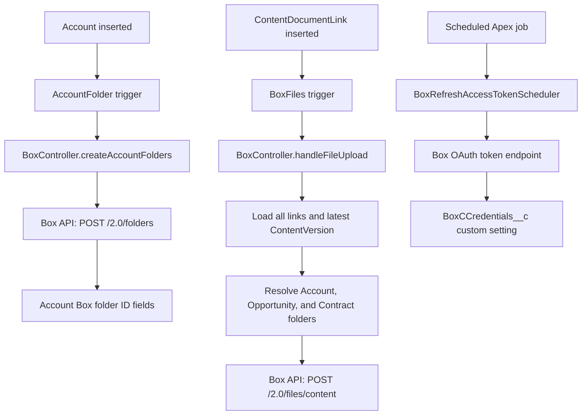

# Salesforce and Box Integration Runbook

## 1. Purpose and scope

This document describes the Box integration currently implemented in this Salesforce DX repository. It is intended for deployment, support, testing, and future maintenance.

The integration currently supports:

- Creating a Box folder structure for an Account.
- Uploading Salesforce Files linked to Accounts, Opportunities, and Contracts.
- Routing Contract files to the Account's Legal Contracts folder and, when configured, a central contract folder based on contract status and type.
- Refreshing the Box OAuth access token through a schedulable Apex class.
- Validating file size, file name, and a small set of blocked extensions before upload.

Box is implemented separately from the SharePoint integration. The `AccountFolder` trigger currently starts both integrations when their respective Account folder ID fields are blank.

## 2. Architecture



### Main components

| Component | Responsibility |
|---|---|
| [AccountFolder.trigger](../force-app/main/default/triggers/AccountFolder.trigger) | Starts Box account-folder creation and SharePoint account-folder processing after Account insert. |
| [BoxFiles.trigger](../force-app/main/default/triggers/BoxFiles.trigger) | Starts Box file processing after a `ContentDocumentLink` insert. |
| [BoxController.cls](../force-app/main/default/classes/BoxController.cls) | Main Box service. Creates folders, loads Salesforce file context, resolves target folders, validates files, builds upload requests, and uploads files. |
| [BoxFilesHelper.cls](../force-app/main/default/classes/BoxFilesHelper.cls) | Older/direct file-routing helper. It can be called explicitly and contains routing logic similar to `BoxController`, but the current trigger calls `BoxController.handleFileUpload` directly. |
| [BoxRefreshAccessTokenScheduler.cls](../force-app/main/default/classes/BoxRefreshAccessTokenScheduler.cls) | Calls the Box OAuth refresh-token endpoint and updates the stored access and refresh tokens. |
| [BoxControllerTest.cls](../force-app/main/default/classes/BoxControllerTest.cls) | Tests folder creation, upload validation, multipart construction, target resolution, and the main upload flow with mocked callouts. |
| [BoxTestClass.cls](../force-app/main/default/classes/BoxTestClass.cls) | Legacy/helper coverage for `BoxFilesHelper`, contract routing, and Box callout mocks. |
| [BoxRefreshAccessTokenSchedulerTestClass.cls](../force-app/main/default/classes/BoxRefreshAccessTokenSchedulerTestClass.cls) | Tests scheduling and token refresh callouts with a mock response. |

## 3. Salesforce-to-Box folder structure

For each Account, the implementation creates this structure beneath the configured Accounts parent folder:

```text
Configured Accounts parent folder/
  <Nick_Name__c or Account.Name> <current year>/
    Legal Contracts/
    Opportunities/
```

The account folder name is sanitized before the Box request. The implementation replaces `/`, `\\`, `.`, `:`, `*`, `?`, `"`, `<`, `>`, and `|` with spaces. A blank name becomes `Unnamed`.

The created Box IDs are stored on Account:

| Account field | Stored value |
|---|---|
| `Folder_Id__c` | Main Account folder ID. |
| `Contract_Folder_Id__c` | `Legal Contracts` child folder ID. |
| `Opportunities_Folder_Id__c` | `Opportunities` child folder ID. |

Folder creation is initiated when `Folder_Id__c` is blank. The current `AccountFolder` trigger does not check for an existing Box folder inside `BoxController.createAccountFolders`; callers should therefore avoid invoking it repeatedly for the same Account.

## 4. Account folder creation flow

1. An Account is inserted.
2. `AccountFolder` exits early if `TriggerControlHelper.isBatchRunning` is true.
3. For each inserted Account whose `Folder_Id__c` is blank, the trigger invokes the `@future(callout=true)` method `BoxController.createAccountFolders`.
4. The service loads the Account name and optional `Nick_Name__c`.
5. The service reads the Box Accounts parent folder ID from `BoxFolderIds__c` record `Account`, field `Accounts__c`.
6. It creates the main Account folder, then `Legal Contracts` and `Opportunities` child folders through the Box folder API.
7. The returned IDs are written to the three Account fields listed above.
8. Errors are caught and written to debug logs. They are not stored in a durable error object and are not automatically retried.

The Account insert transaction is separate from the future callout. An Account can therefore be committed while Box folder creation later fails.

## 5. File upload flow

1. A Salesforce File creates a `ContentDocumentLink`.
2. `BoxFiles` invokes `BoxController.handleFileUpload` with the first trigger record's link ID.
3. The controller loads the primary link, all links for the same `ContentDocument`, and the latest `ContentVersion`.
4. Each linked entity is classified by Salesforce ID prefix:
   - `001`: Account
   - `006`: Opportunity
   - `800`: Contract
   - `005`: User, skipped because Users have no dedicated Box folder
5. The controller resolves one or more Box folder IDs.
6. Duplicate target folder IDs are removed while preserving the first-seen order.
7. The latest file is validated and uploaded to every resolved folder.
8. Each folder upload is attempted up to three times.
9. The result and any failed folder IDs are written to debug logs.

The public `BoxController.uploadFileToBox` method is also asynchronous and can be invoked directly by Apex callers. `BoxFilesHelper.uploadFiles` is a separate direct-routing path that calls this method for the account and central contract destinations it resolves.

### File validation

The controller rejects or skips processing when:

- File content is missing.
- The client file name is blank.
- The file is larger than 50 MB.
- The extension is `exe`, `bat`, `cmd`, or `scr`.
- No valid target folder can be resolved.

The upload uses a `multipart/form-data` request. The JSON attributes contain the file name and Box parent folder ID. Binary content is combined with the multipart headers and footer using hexadecimal Blob conversion so binary files can be transmitted without string conversion.

### Box API requests

| Operation | Named Credential reference | Method and relative path |
|---|---|---|
| Create folder | `callout:Box` | `POST /2.0/folders` |
| Upload file | `callout:Box_Upload` | `POST /2.0/files/content` |
| Refresh OAuth token | Direct endpoint | `POST https://api.box.com/oauth2/token` |

Both folder and upload requests use a 120-second timeout. HTTP responses with status code 400 or higher are treated as errors. Folder creation expects HTTP 201; file upload also succeeds only for HTTP 201.

## 6. File destination rules

### Account files

A file linked to an Account is uploaded to that Account's `Folder_Id__c`.

### Opportunity files

A file linked to an Opportunity is uploaded to the parent Account's `Opportunities_Folder_Id__c`. If the parent Account has no main Box folder ID, the implementation attempts to start Account folder creation before re-querying the Account.

### Contract files

A file linked to a Contract can be uploaded to two destinations:

1. The parent Account's `Contract_Folder_Id__c`.
2. A central folder selected from `BoxFolderIds__c` record `LegalContract`.

The central destination is selected using the following rules:

| Contract condition | `BoxFolderIds__c` field |
|---|---|
| Status `Active` and type `1-way CDA`, `2-way CDA`, or `3-way CDA` | `CDA__c` |
| Status `Active` and type `LOI` | `LOI__c` |
| Status `Active` and type `MSA` | `MSA__c` |
| Status `Active` and type `CSA` | `CSA__c` |
| Status `Active` and type `QAA` | `QAA__c` |
| Status `Executive Review` | `Executive_Review__c` |
| Status `Client Review` | `Client_Review__c` |
| Status `Internal Review` | `Internal_Review__c` |
| Status `Terminated`, `Expired`, or `Draft` and type `Not Checked` | `Misc__c` |
| Any other combination | No central folder is selected. |

The picklist values are compared as exact strings. Changes to Contract status or type values must be reflected in the Apex logic and tests.

## 7. Required Salesforce configuration

### 7.1 Named Credentials

Create and validate these Named Credentials with the exact names used in Apex:

- `Box`: used by folder creation through `callout:Box`.
- `Box_Upload`: used by file uploads through `callout:Box_Upload`.

Configure each credential to authenticate to the appropriate Box API host and provide the authorization expected by the Box application. The Named Credential configuration is not represented as source metadata in this repository, so it must be verified separately in each Salesforce org.

The implementation does not read `Access_Token__c` when constructing folder or file requests. The active authentication for those requests is controlled by the Named Credentials. This means updating the custom setting token values does not, by itself, prove that the Named Credentials are using the new token.

### 7.2 `BoxCCredentials__c` custom setting

Create the list custom setting record with name `Box_Credentials`:

| Field | Purpose |
|---|---|
| `Client_Id__c` | Box application client ID. |
| `Client_Secret__c` | Box application client secret. Treat as sensitive. |
| `Access_Token__c` | Latest access token returned by Box. |
| `Refresh_Token__c` | Refresh token used to obtain a new access token. |

Do not commit real secrets or tokens to source control. The class currently logs response bodies during token refresh, so debug logs must be handled as sensitive operational data.

### 7.3 `BoxFolderIds__c` custom setting

Create the list custom setting records below:

#### Record: `Account`

| Field | Purpose |
|---|---|
| `Accounts__c` | Box parent folder ID under which Account folders are created. |

#### Record: `LegalContract`

| Field | Purpose |
|---|---|
| `CDA__c` | Central CDA folder ID. |
| `LOI__c` | Central LOI folder ID. |
| `MSA__c` | Central MSA folder ID. |
| `CSA__c` | Central CSA folder ID. |
| `QAA__c` | Central QAA folder ID. |
| `Executive_Review__c` | Central Executive Review folder ID. |
| `Client_Review__c` | Central Client Review folder ID. |
| `Internal_Review__c` | Central Internal Review folder ID. |
| `Misc__c` | Central miscellaneous folder ID. |

### 7.4 Account fields

Verify that Account contains these fields and that the integration user can update them:

- `Folder_Id__c`
- `Contract_Folder_Id__c`
- `Opportunities_Folder_Id__c`

## 8. OAuth token refresh

`BoxRefreshAccessTokenScheduler` implements `Schedulable` and delegates to the future method `refreshAccessToken`.

The refresh request is sent to `https://api.box.com/oauth2/token` with URL-encoded form parameters:

- `client_id`
- `client_secret`
- `refresh_token`
- `grant_type=refresh_token`

For HTTP 200, the response is deserialized into `BoxController.OAuthResult`, and the returned access and refresh tokens replace the values in `BoxCCredentials__c`. Non-200 responses are only logged.

The repository contains the schedulable class and tests, but it does not define a schedule expression or automatically schedule the job. An administrator or deployment script must schedule it at an appropriate interval, and the Named Credential authentication must be kept aligned with the refresh strategy.

## 9. Testing

The Box tests use `HttpCalloutMock`; they do not call a real Box tenant.

Recommended focused test classes:

```powershell
sf apex run test --tests BoxControllerTest,BoxTestClass,BoxRefreshAccessTokenSchedulerTestClass --result-format human --wait 10
```

The tests cover:

- Successful Account folder creation with mocked 201 responses.
- Null Account ID handling.
- File upload parameter validation.
- Folder-name sanitization.
- Multipart body construction.
- Parent-folder configuration and root fallback helper behavior.
- Account, Opportunity, Contract, and User link processing.
- Contract routing branches.
- Scheduler invocation and token refresh response handling.

Mocked tests do not prove that the Named Credentials, Box application permissions, token lifecycle, folder IDs, or production Box tenant are configured correctly.

## 10. Deployment and validation checklist

1. Confirm the Account fields exist in the target org.
2. Confirm the `BoxCCredentials__c` record is present without exposing its secrets in source control.
3. Confirm the `BoxFolderIds__c` records `Account` and `LegalContract` contain valid Box folder IDs.
4. Create and authenticate Named Credentials named `Box` and `Box_Upload`.
5. Confirm the Box application has permission to create folders and upload files.
6. Deploy the Apex classes and triggers.
7. Run the focused Box tests and the full local Apex test suite.
8. Insert a test Account and verify the three Box folder ID fields after the future job completes.
9. Link a small PDF to an Account, Opportunity, and Contract and verify every expected Box destination.
10. Test an unsupported extension and a file larger than 50 MB.
11. Test each contract status/type routing branch that is valid in the target org.
12. Run a token refresh in a non-production environment and verify the stored values without exposing them in logs.
13. Confirm debug logs and Apex job status are available to the support team.

## 11. Current limitations and maintenance notes

- `BoxFiles` processes only `Trigger.new[0]`. A bulk insert of multiple `ContentDocumentLink` records can leave later files unprocessed. The trigger should be bulkified before relying on bulk file operations.
- Account folder creation and file upload are future methods. A file linked immediately after Account creation can run before the Account folder IDs have been written; the current code attempts to start folder creation but does not provide a durable coordination or replay mechanism.
- Folder and upload failures are written to debug logs only. There is no persistent error record, notification, dead-letter queue, or automatic replay process.
- `BoxController.createAccountFolders` does not itself prevent duplicate folder creation when called directly for an Account that already has `Folder_Id__c` populated.
- The code uses Salesforce ID prefixes to identify entity types. This is concise but should be revisited if the integration is extended to additional object types or namespaces.
- `BoxFilesHelper` duplicates routing logic from `BoxController`. Changes to contract routing must be kept consistent in both paths until the helper is retired or consolidated.
- The token refresh class updates custom-setting tokens, while folder and upload requests use Named Credentials. Authentication ownership should be documented and tested in the target org so token refresh does not create a false sense of renewal.
- The code logs request and response details in several places. Review log levels and remove sensitive response data before enabling verbose logging in production.

This document describes the repository implementation as of its last update. Update it whenever the Box Apex classes, triggers, Account fields, custom settings, Named Credentials, or contract routing values change.
