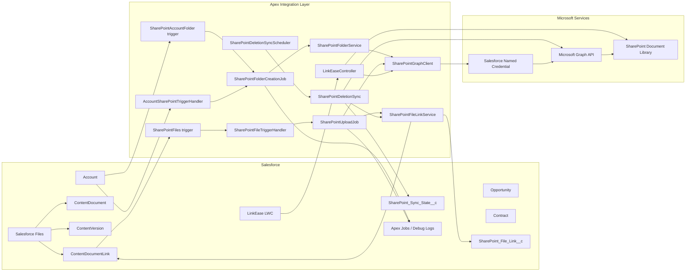
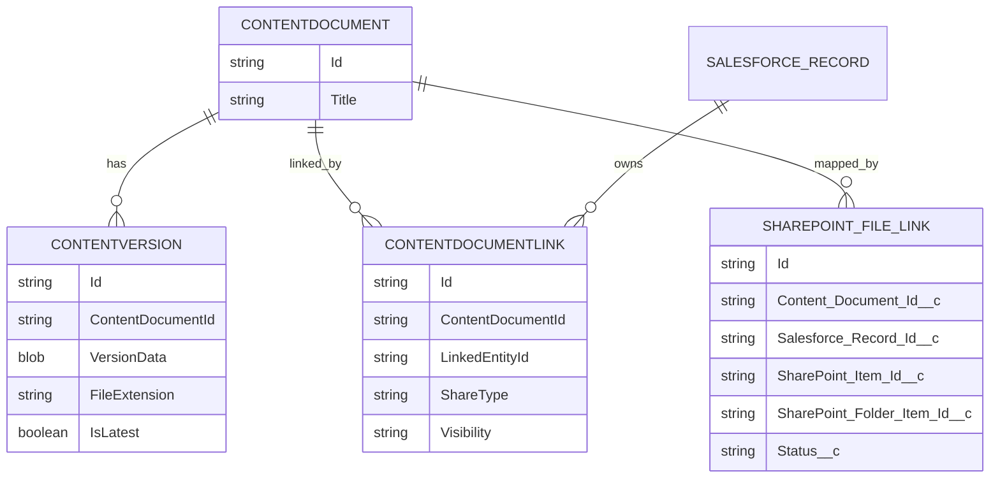
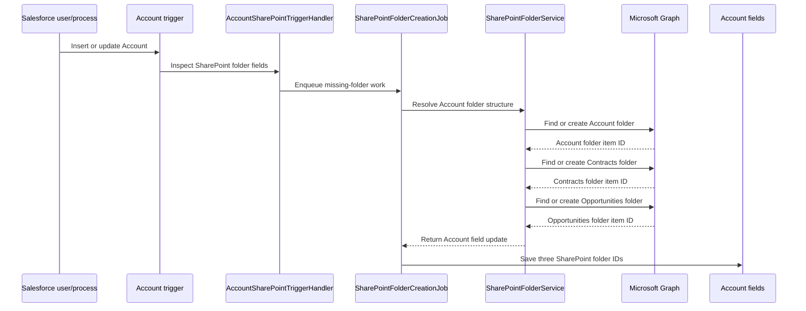
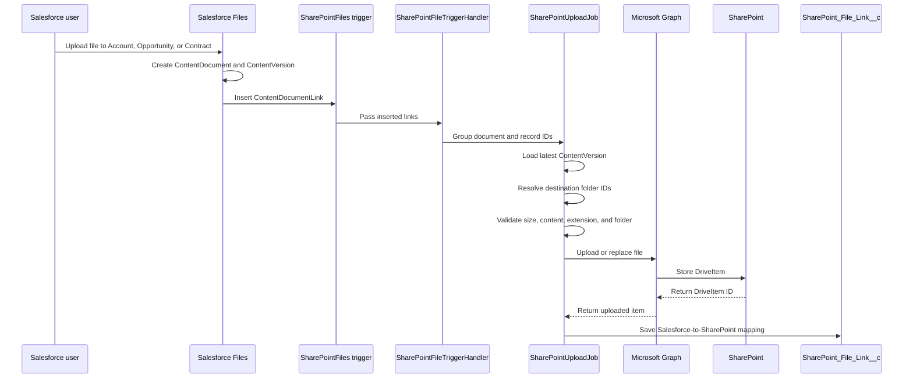
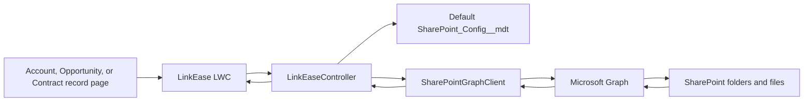
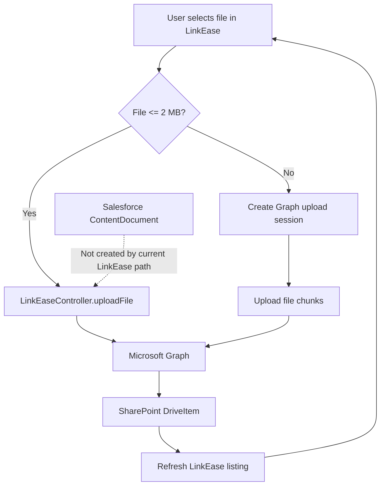
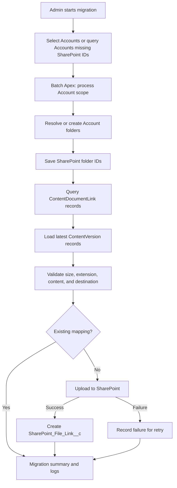

# Salesforce and SharePoint Integration Plan

## 1. Executive Summary

This document describes the Salesforce and SharePoint integration currently implemented in this repository, the user-facing workflows, the technical architecture, the deployment requirements, and the recommended next phase for migrating existing Salesforce Accounts and Files.

The solution has two separate SharePoint entry points:

1. **Salesforce Files synchronization**
   - A user uploads a file through the Salesforce Files related list.
   - Salesforce creates `ContentDocument`, `ContentVersion`, and `ContentDocumentLink` records.
   - The `ContentDocumentLink` trigger starts an asynchronous SharePoint upload.
   - The file is uploaded to the Account, Opportunity, or Contract SharePoint destination.

2. **LinkEase direct SharePoint experience**
   - The LinkEase LWC lists folders and files directly from SharePoint through Microsoft Graph.
   - Files selected in LinkEase are uploaded directly to SharePoint.
   - LinkEase intentionally does not create Salesforce `ContentDocument`, `ContentVersion`, or `ContentDocumentLink` records.

The two paths share the same SharePoint folder structure and Microsoft Graph client, but they do not share the same Salesforce file lifecycle.

## 2. Goals and Non-Goals

### Goals

- Create and maintain SharePoint folders for Salesforce Accounts.
- Route Salesforce Files to the correct SharePoint folders.
- Support Account, Opportunity, and Contract file destinations.
- Route Contract files to both Account and central contract folders when configured.
- Provide a LinkEase browser and direct upload experience.
- Track Salesforce-to-SharePoint file relationships for deletion synchronization.
- Process work asynchronously so normal Salesforce transactions are not blocked by Microsoft Graph callouts.
- Provide a safe future path for existing Account and Salesforce File migration.

### Non-goals in the current implementation

- LinkEase uploads do not create Salesforce Files.
- SharePoint is not used as a replacement for Salesforce Files in every workflow.
- There is no completed bulk migration job for all existing Accounts and Files.
- There is no durable retry queue or integration error object.
- The legacy Box integration has not been removed or merged with SharePoint.

## 3. High-Level Architecture



## 4. Implemented Components

| Component | Type | Current responsibility |
|---|---|---|
| `AccountFolder.trigger` | Apex trigger | Starts only the legacy Box Account-folder path on Account insert. |
| `SharePointAccountFolder.trigger` | Apex trigger | Starts SharePoint Account-folder processing on Account insert or update. |
| `AccountSharePointTriggerHandler.cls` | Apex class | Detects Accounts whose SharePoint folder fields are missing and enqueues folder work. |
| `SharePointFolderCreationJob.cls` | Queueable Apex | Performs SharePoint folder callouts and saves returned folder IDs to Account fields. |
| `SharePointFolderService.cls` | Apex service | Resolves or creates the Account folder and its `Contracts` and `Opportunities` child folders. |
| `SharePointGraphClient.cls` | Apex HTTP client | Calls Microsoft Graph for folder lookup, folder creation, file upload, upload sessions, file listing, item URLs, and delta changes. |
| `SharePointFiles.trigger` | Apex trigger | Runs after `ContentDocumentLink` insertion. |
| `SharePointFileTriggerHandler.cls` | Apex handler | Filters links to Account, Opportunity, and Contract records and groups them by `ContentDocumentId`. |
| `SharePointUploadJob.cls` | Queueable Apex | Loads the latest `ContentVersion`, validates it, resolves destinations, uploads it, retries failures, and records mappings. |
| `SharePointFileLinkService.cls` | Apex service | Creates and updates `SharePoint_File_Link__c` records and removes matching Salesforce links when SharePoint reports deletion. |
| `SharePointDeletionSync.cls` | Queueable Apex | Reads Microsoft Graph delta results and processes deleted SharePoint items. |
| `SharePointDeletionSyncScheduler.cls` | Schedulable Apex | Enqueues the deletion synchronization job. |
| `LinkEaseController.cls` | Apex controller | Provides LinkEase folder browsing, listing, direct uploads, chunked uploads, downloads, and folder reconciliation. |
| `linkEase` | LWC | Provides the user interface for browsing and directly uploading SharePoint files from Salesforce record pages. |

## 5. Salesforce Files Data Model

When a user uploads a file from Salesforce's standard Files component, Salesforce creates or uses three related records:



### Meaning of each record

- `ContentDocument`: the permanent Salesforce identity of the file.
- `ContentVersion`: the actual binary file and each version of that file.
- `ContentDocumentLink`: the relationship showing which Salesforce record owns or uses the file.
- `SharePoint_File_Link__c`: the custom integration mapping between the Salesforce file and the SharePoint DriveItem.

The current SharePoint synchronization begins when `ContentDocumentLink` is inserted. LinkEase direct uploads do not enter this Salesforce Files lifecycle.

## 6. Account Folder Creation

### Folder hierarchy

```text
Configured SharePoint Accounts parent folder/
  <Nick_Name__c or Account.Name> <current year>/
    Contracts/
    Opportunities/
```

The current Apex implementation creates the child folder named `Contracts`. Some documentation and business terminology refer to this as `Legal Contracts`; the production naming must be confirmed before final sign-off.

Account names are sanitized before folder creation. The implementation replaces SharePoint-invalid characters including:

```text
/  \\  :  *  ?  "  <  >  |  #  %
```

### Account fields

| Salesforce field | Purpose |
|---|---|
| `SharePoint_Folder_Id__c` | SharePoint Account root folder item ID. |
| `SharePoint_Contract_Folder_Id__c` | SharePoint Contracts child folder item ID. |
| `SharePoint_Opportunities_Folder_Id__c` | SharePoint Opportunities child folder item ID. |

### Account creation flow



The work is asynchronous. The Account transaction can complete before the folder IDs are available.

## 7. Standard Salesforce File Synchronization

### End-to-end file flow



### Supported linked records

The trigger handler processes links whose `LinkedEntityId` is one of:

- Account
- Opportunity
- Contract

Links to unsupported records, such as User records, are ignored by the SharePoint handler.

### File validation

The upload job skips a file when:

- The latest `ContentVersion` cannot be found.
- `VersionData` is unavailable.
- The file exceeds 50 MB.
- The file extension is `exe`, `bat`, `cmd`, or `scr`.
- The required SharePoint folder ID is blank.

The current implementation writes failures and skips to debug logs. It does not yet create a durable error record or automatically replay failed work.

### Upload scale and retry behavior

- The job processes up to 100 upload requests in one queueable execution.
- Remaining requests are chained into another queueable.
- Each Graph upload is attempted up to three times.
- A file with the same name in the same folder uses Microsoft Graph replace behavior through the file-content endpoint.
- The current job can load file binary content into Apex heap, so the 50 MB limit is intentionally conservative.

## 8. Destination Routing Rules

### Account files

A file linked directly to an Account is uploaded to:

```text
Account SharePoint root folder
```

### Opportunity files

A file linked to an Opportunity is uploaded to:

```text
Parent Account / Opportunities
```

The Opportunity itself does not have a separate SharePoint root folder in the current design.

### Contract files

A file linked to a Contract can be uploaded to two destinations:

```text
Parent Account / Contracts
Central contract folder selected from Contract status and type
```

### Central contract routing

| Contract status and type | Central folder |
|---|---|
| `Active` + `1-way CDA`, `2-way CDA`, or `3-way CDA` | CDA |
| `Active` + `LOI` | LOI |
| `Active` + `MSA` | MSA |
| `Active` + `CSA` | CSA |
| `Active` + `QAA` | QAA |
| `Executive Review` | Executive Review |
| `Client Review` | Client Review |
| `Internal Review` | Internal Review |
| Any other combination | Misc |

The exact picklist text is significant. If Salesforce picklist values change, the routing logic and tests must be updated together.

## 9. LinkEase User Experience

### LinkEase architecture



### LinkEase capabilities currently implemented

- Browse the Account SharePoint folder.
- Browse Contracts and Opportunities child folders.
- Display SharePoint files and folders.
- Open the current folder in SharePoint.
- Download a selected SharePoint file through a server-generated download URL.
- Upload files up to 50 MB through the direct upload endpoint.
- Upload larger files through Microsoft Graph upload sessions and chunks.
- Retry Account folder preparation when IDs are missing.
- Reconcile legacy Account folder IDs through `requestFolderReconciliation`.
- Reject restricted file extensions in the UI and Apex.

### LinkEase file lifecycle



LinkEase is intentionally a direct SharePoint experience. A file uploaded there appears in LinkEase and SharePoint, but not in the Salesforce Files related list unless a separate Salesforce File is created by another process.

## 10. Deletion Synchronization

Deletion synchronization is one-way from SharePoint to Salesforce Files.

```mermaid
sequenceDiagram
    participant Scheduler as SharePointDeletionSyncScheduler
    participant Job as SharePointDeletionSync
    participant Graph as Microsoft Graph delta API
    participant State as SharePoint_Sync_State__c
    participant Mapping as SharePoint_File_Link__c
    participant Link as ContentDocumentLink

    Scheduler->>Job: Enqueue scheduled sync
    Job->>State: Read last delta link
    Job->>Graph: Request delta changes
    Graph-->>Job: Deleted DriveItem IDs and next delta links
    Job->>Mapping: Find active mappings for deleted items
    Mapping-->>Job: Salesforce document and record IDs
    Job->>Link: Delete matching ContentDocumentLink
    Job->>State: Save latest delta link and sync time
```

Important behavior:

- The matching `ContentDocumentLink` is deleted.
- The underlying `ContentDocument` is not deleted because it may be linked to other Salesforce records.
- LinkEase uploads normally have no `ContentDocumentLink`, so they are not affected by this Salesforce-file deletion path.
- The scheduler must be configured by an administrator; the repository provides the schedulable class but does not automatically schedule it.

## 11. Security and Authentication

### Salesforce configuration

The Apex integration uses:

```text
Named Credential: SharePoint_Graph
```

The Named Credential should use an External Credential or supported Salesforce authentication model. Secrets and access tokens must not be stored in Apex, custom metadata, or source control.

### SharePoint configuration

The `Default` `SharePoint_Config__mdt` record supplies:

- `Drive_Id__c`
- `Accounts_Parent_Item_Id__c`
- Central contract folder item IDs
- Optional legacy item-ID fields used by the current resolver
- Optional CRM root configuration for folder-name lookup

The Microsoft identity must have only the Graph permissions required to:

- Read SharePoint folder contents.
- Find folders by name.
- Create Account and child folders.
- Upload and replace files.
- Create upload sessions.
- Read item metadata and download URLs.
- Read delta changes.

### Data protection controls

- Do not log access tokens, client secrets, or download URLs unnecessarily.
- Use Salesforce sharing and field-level security for Account folder ID fields.
- Restrict access to the LinkEase component to supported record pages and authorized users.
- Validate record IDs before performing Graph operations.
- Keep file extension and size validation in both client and Apex layers.

## 12. Existing Account and File Backfill Plan

This is the recommended next phase for Accounts and Salesforce Files that already exist in Salesforce.

### Objective

For every selected existing Account:

1. Create or find the Account SharePoint folder.
2. Create or find Contracts and Opportunities child folders.
3. Save the three folder IDs to Salesforce.
4. Find Salesforce Files linked to the Account.
5. Upload each latest file version to the Account SharePoint folder.
6. Create `SharePoint_File_Link__c` mappings.
7. Skip files already mapped to the same SharePoint destination.
8. Record failures for retry.

### Backfill architecture



### Recommended implementation shape

Add a dedicated migration workflow rather than reusing the Account insert trigger directly:

- `SharePointExistingAccountMigrationBatch.cls`
- `SharePointExistingFileMigrationQueueable.cls`
- `SharePointMigrationLog__c` or an equivalent durable status object
- Optional admin-started Apex command or LWC
- A dry-run mode that reports counts without creating folders or uploading files

The migration should process Accounts in small scopes because each Account can require multiple Graph callouts. File uploads should be chained or queued separately so Account folder creation completes before file routing begins.

### Backfill scope options

| Scope | Use case |
|---|---|
| Accounts with any blank SharePoint field | Repair incomplete folder setup. |
| Accounts created before a cutoff date | One-time historical migration. |
| Accounts selected by an admin | Controlled pilot or phased rollout. |
| Accounts with Salesforce Files but no active mapping | Reconciliation and retry. |

### Backfill safeguards

- Never create a second Account folder when a unique existing folder can be found.
- Use a deterministic idempotency key: `ContentDocumentId + SalesforceRecordId + SharePointFolderItemId`.
- Do not upload unsupported file extensions.
- Do not attempt files above the supported size limit without an upload-session design.
- Do not delete Salesforce Files when a SharePoint upload fails.
- Log each failed Account, file, target folder, and error message.
- Allow the migration to be restarted safely.
- Produce a final report containing processed, skipped, uploaded, duplicate, and failed counts.

## 13. Deployment and Configuration Plan

### Phase 1: Salesforce metadata

1. Deploy SharePoint Apex classes and triggers.
2. Deploy Account SharePoint folder fields.
3. Deploy `SharePoint_Config__mdt` and the `Default` record structure.
4. Deploy `SharePoint_File_Link__c` and `SharePoint_Sync_State__c` objects.
5. Confirm field-level security and permissions.

### Phase 2: Microsoft identity and Named Credential

1. Register or identify the Microsoft Entra application.
2. Grant only required Microsoft Graph permissions.
3. Obtain tenant admin consent.
4. Create the Salesforce External Credential.
5. Assign the External Credential principal to the integration permission set or user.
6. Create the `SharePoint_Graph` Named Credential.
7. Confirm the base URL and authentication status.

### Phase 3: SharePoint structure

1. Identify the target site and document library.
2. Identify the Accounts parent folder item ID.
3. Identify central contract folders.
4. Confirm the integration identity can read, create, and upload.
5. Confirm the production child-folder naming convention: `Contracts` versus `Legal Contracts`.

### Phase 4: Controlled deployment

1. Deploy to a sandbox.
2. Run focused Apex tests.
3. Create one pilot Account.
4. Validate Account folder creation.
5. Upload test files to Account, Opportunity, and Contract records.
6. Validate LinkEase browsing and direct upload.
7. Validate deletion synchronization in a disposable test folder.
8. Approve production deployment only after all evidence is recorded.

## 14. Test Plan

### Automated tests

At minimum, test:

- Graph file upload request construction.
- Graph folder lookup and folder creation.
- Missing configuration behavior.
- Restricted extension rejection.
- File-size rejection.
- Account folder creation and Account field updates.
- Existing folder reuse.
- Account, Opportunity, and Contract destination routing.
- Contract status/type central-folder mapping.
- Bulk `ContentDocumentLink` handling.
- Retry behavior and final failure handling.
- Latest `ContentVersion` selection.
- SharePoint mapping creation and update.
- Delta deletion handling.
- LinkEase folder listing, download, direct upload, chunk upload, and refresh behavior.
- Existing-account migration idempotency once the backfill is implemented.

### Manual end-to-end tests

1. Create an Account and confirm all three SharePoint folder IDs are eventually populated.
2. Upload a small PDF through the Account Files related list.
3. Confirm a `ContentDocumentLink` exists.
4. Confirm the file appears in the Account SharePoint folder.
5. Upload a file to an Opportunity and confirm it appears only in `Opportunities`.
6. Upload Contract files for each supported routing combination.
7. Open LinkEase from Account, Opportunity, and Contract records.
8. Browse folders and files.
9. Upload a small LinkEase file and confirm it appears in SharePoint and LinkEase.
10. Upload a larger LinkEase file using the chunked path.
11. Test blocked extensions and oversized Salesforce Files.
12. Delete a mapped SharePoint item and verify only the matching Salesforce link is removed.
13. Confirm Salesforce Files that are linked to multiple records are not incorrectly deleted.

## 15. Monitoring and Operations

### Current monitoring

- Setup > Apex Jobs for queueable status.
- Salesforce debug logs for skipped and failed work.
- SharePoint audit/activity logs.
- Microsoft Graph response status and error messages.

### Recommended operational improvements

- Add a durable integration log object.
- Store status, attempt count, target folder, last error, and next retry time.
- Add an admin retry action.
- Add a migration dashboard with processed and failed counts.
- Alert on repeated Graph `429`, `401`, `403`, and `5xx` responses.
- Monitor queueable chain depth and execution time.
- Schedule and monitor the deletion synchronization job.

## 16. Current Limitations and Risks

1. The SharePoint folder queueable currently processes one Account per execution and chains remaining Accounts, although documentation may describe the process as a batch of 30.
2. The Salesforce File upload job uses `ContentVersion.VersionData`, so the current safe limit is 50 MB.
3. LinkEase uploads bypass Salesforce Files and are not represented by `ContentDocumentLink`.
4. LinkEase and Salesforce Files can therefore show different file sets.
5. SharePoint upload failures are logged but are not stored in a durable retry object.
6. The `SharePointFiles` trigger is bulk-aware at the handler level, but the legacy `BoxFiles` trigger still processes only `Trigger.new[0]`.
7. The Account trigger starts both legacy Box and SharePoint processing when their respective fields are missing.
8. The same Account or Salesforce File can be processed by both Box and SharePoint if both integrations remain enabled.
9. Folder naming documentation must be aligned with the actual `Contracts` folder name.
10. Central contract folder configuration contains both current and legacy field naming patterns; production metadata must be verified.
11. The deletion scheduler exists but requires explicit Salesforce scheduling.
12. There is no completed historical backfill for existing Accounts and Files.

## 17. Recommended Delivery Roadmap

### Phase 0: Confirm production facts

- Confirm SharePoint site, drive, parent folder, child folder names, and central contract folders.
- Confirm whether Box should remain enabled.
- Confirm the maximum supported file size and required Graph permissions.

### Phase 1: Stabilize current integration

- Add durable integration logging.
- Add bulk tests for both file triggers.
- Align documentation and production folder names.
- Add monitoring for queueable failures.
- Schedule deletion synchronization.

### Phase 2: Existing Account and File migration

- Build dry-run account scope selection.
- Create or repair folders for existing Accounts.
- Upload existing latest Salesforce File versions.
- Create mappings and migration reports.
- Add idempotency and retry support.

### Phase 3: User experience alignment

- Decide whether LinkEase uploads should remain SharePoint-only or also create Salesforce Files.
- If unified visibility is required, design a deliberate duplicate-prevention and large-file strategy before changing LinkEase.
- Add user-facing status for asynchronous Salesforce-to-SharePoint uploads.

### Phase 4: Production operations

- Run a pilot migration.
- Review errors and duplicate behavior.
- Migrate Accounts in controlled batches.
- Validate reconciliation counts.
- Sign off with deployment, test, Apex Job, and SharePoint evidence.

## 18. Final Acceptance Criteria

The integration is ready for production sign-off when:

- The Named Credential authenticates successfully.
- The `Default` SharePoint configuration is complete and compiles.
- Account folders and child folders are created or reused correctly.
- Salesforce Files route to the expected SharePoint destinations.
- Contract files follow the documented status/type rules.
- LinkEase can browse, download, and directly upload files.
- Restricted and oversized files are rejected or skipped as designed.
- Duplicate file names use the intended replace behavior.
- Deletion synchronization removes only the intended Salesforce link.
- Queueable failures are visible to operations.
- Existing Account/File migration, if approved, produces an idempotent report.
- Box and SharePoint responsibilities are explicitly approved and documented.

## 19. Source References

- [Salesforce and SharePoint Integration Runbook](salesforce-sharepoint-integration.md)
- [Salesforce and SharePoint Integration Flow](salesforce-sharepoint-flow.md)
- [LinkEaseController.cls](../force-app/main/default/classes/LinkEaseController.cls)
- [SharePointFolderService.cls](../force-app/main/default/classes/SharePointFolderService.cls)
- [SharePointFolderCreationJob.cls](../force-app/main/default/classes/SharePointFolderCreationJob.cls)
- [SharePointUploadJob.cls](../force-app/main/default/classes/SharePointUploadJob.cls)
- [SharePointFileTriggerHandler.cls](../force-app/main/default/classes/SharePointFileTriggerHandler.cls)
- [SharePointFileLinkService.cls](../force-app/main/default/classes/SharePointFileLinkService.cls)
- [SharePointDeletionSync.cls](../force-app/main/default/classes/SharePointDeletionSync.cls)
- [SharePointGraphClient.cls](../force-app/main/default/classes/SharePointGraphClient.cls)
