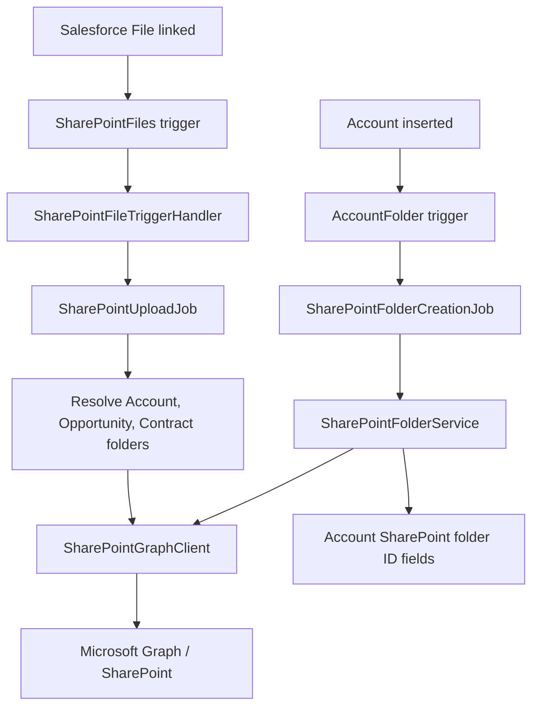

# Salesforce and SharePoint Integration Runbook

## 1. Purpose

This document records the Salesforce to SharePoint integration currently implemented in this repository. It is intended to help a new developer understand the design, reproduce the setup, troubleshoot failures, and extend the integration safely.

The integration currently supports:

- Creating a SharePoint account folder structure when an Account is created.
- Uploading Salesforce Files to SharePoint when a file is linked to an Account, Opportunity, or Contract.
- Routing Contract files to both the Account contract folder and a central folder based on contract type and status.
- Asynchronous processing, batching, retrying uploads, and basic file validation.

The repository also contains a separate, older Box integration. Box and SharePoint should be treated as separate integrations unless a migration project explicitly combines them.

## 2. Architecture



### Main components

| Component | Responsibility |
|---|---|
| [AccountFolder.trigger](../force-app/main/default/triggers/AccountFolder.trigger) | Starts Box and SharePoint account-folder processing after Account insert. |
| [SharePointFolderCreationJob.cls](../force-app/main/default/classes/SharePointFolderCreationJob.cls) | Queueable callout job that processes account folder creation in batches of 30 Accounts. |
| [SharePointFolderService.cls](../force-app/main/default/classes/SharePointFolderService.cls) | Reads configuration, creates the account folder and two child folders, and saves returned IDs. |
| [SharePointGraphClient.cls](../force-app/main/default/classes/SharePointGraphClient.cls) | Low-level Microsoft Graph HTTP client for folder lookup, folder creation, and file upload. |
| [SharePointFiles.trigger](../force-app/main/default/triggers/SharePointFiles.trigger) | Starts SharePoint file processing after a ContentDocumentLink is inserted. |
| [SharePointFileTriggerHandler.cls](../force-app/main/default/classes/SharePointFileTriggerHandler.cls) | Filters supported linked objects and groups links by ContentDocument. |
| [SharePointUploadJob.cls](../force-app/main/default/classes/SharePointUploadJob.cls) | Resolves target folders, loads the latest ContentVersion, validates files, retries uploads, and chains remaining work. |

## 3. Account folder structure

For each Account, the service creates:

```text
Accounts parent folder/
  <Nick_Name__c or Account.Name> <current year>/
    Legal Contracts/
    Opportunities/
```

The account folder name is sanitized by replacing SharePoint-invalid characters such as `/`, `\\`, `:`, `*`, `?`, `"`, `<`, `>`, `|`, `#`, and `%` with spaces.

The returned SharePoint item IDs are stored on Account:

- `SharePoint_Folder_Id__c`: account folder.
- `SharePoint_Contract_Folder_Id__c`: `Legal Contracts` child folder.
- `SharePoint_Opportunities_Folder_Id__c`: `Opportunities` child folder.

If `SharePoint_Folder_Id__c` is already populated, folder creation returns without creating another structure.

## 4. Account creation flow

1. Salesforce inserts an Account.
2. `AccountFolder` checks whether batch processing is active. If it is, the trigger exits.
3. The existing Box flow is invoked when `Folder_Id__c` is blank.
4. The SharePoint Account ID is added to a set when `SharePoint_Folder_Id__c` is blank.
5. One `SharePointFolderCreationJob` is enqueued for the set.
6. The queueable processes up to 30 Accounts. Each Account can require three Graph callouts: account folder, Legal Contracts, and Opportunities.
7. Remaining Accounts are processed by a chained queueable job.
8. Folder IDs are saved back to the Account.

The SharePoint work is asynchronous. The Account transaction can succeed even if the later Graph callout fails, so monitoring and retry/reconciliation are operational requirements.

## 5. File upload flow

1. A Salesforce File creates a `ContentDocumentLink`.
2. `SharePointFiles` runs after insert.
3. `SharePointFileTriggerHandler` accepts links only for Account, Opportunity, and Contract records.
4. Links are grouped by ContentDocument and passed to `SharePointUploadJob`.
5. The job loads the latest `ContentVersion` and determines all target folders:
   - Account link: the Account folder.
   - Opportunity link: the parent Account's Opportunities folder.
   - Contract link: the parent Account's Legal Contracts folder plus one central contract folder.
6. The latest file is uploaded to every distinct target folder.
7. A file with the same name is replaced through the Microsoft Graph `PUT ...:/content` endpoint.
8. Each upload is retried up to three times. Failed uploads are logged after the final attempt.
9. The job handles up to 100 upload requests and chains a new queueable for the remainder.

### File validation

Uploads are skipped when:

- The latest ContentVersion or its file data is unavailable.
- The file is larger than 50 MB.
- The extension is `exe`, `bat`, `cmd`, or `scr`.
- The required SharePoint folder ID is blank.

The current implementation logs skipped and failed work with `System.debug`. It does not create a durable Salesforce error record or automatically replay failed uploads.

## 6. Contract routing rules

`SharePointFolderService.resolveContractFolderName` maps Contract fields as follows:

| Contract condition | Central folder |
|---|---|
| Active and type `1-way CDA`, `2-way CDA`, or `3-way CDA` | CDA |
| Active and type `LOI` | LOI |
| Active and type `MSA` | MSA |
| Active and type `CSA` | CSA |
| Active and type `QAA` | QAA |
| Status `Executive Review` | Executive Review |
| Status `Client Review` | Client Review |
| Status `Internal Review` | Internal Review |
| Anything else | Misc |

The exact text values are significant. Changes to picklist values must be reflected in the mapping and its tests.

## 7. Salesforce configuration

### 7.1 Named Credential

The Apex client uses the named credential reference:

```text
callout:SharePoint_Graph
```

Create a Salesforce Named Credential with the exact name `SharePoint_Graph`. It must authenticate to Microsoft Graph and use a base URL compatible with the relative paths used by the client, for example:

```text
https://graph.microsoft.com
```

Use an External Credential or equivalent supported authentication method. Do not store client secrets or access tokens in Apex, custom metadata, or source control.

The Microsoft identity must have only the Graph permissions required for the selected SharePoint drive and operations. Confirm the tenant admin consent and the effective permission model before production use.

### 7.2 Custom metadata

The code reads the record:

```text
SharePoint_Config__mdt.getInstance('Default')
```

The record must contain these values:

| Code reference | Meaning |
|---|---|
| `Drive_Id__c` | SharePoint document library drive ID. |
| `Accounts_Parent_Item_Id__c` | Parent item ID under which Account folders are created. |
| `CDA_Folder_Item_Id__c` | Central CDA folder item ID. |
| `LOI_Folder_Item_Id__c` | Central LOI folder item ID. |
| `MSA_Folder_Item_Id__c` | Central MSA folder item ID. |
| `CSA_Folder_Item_Id__c` | Central CSA folder item ID. |
| `QAA_Folder_Item_Id__c` | Central QAA folder item ID. |
| `Executive_Review_Folder_Item_Id__c` | Central Executive Review folder item ID. |
| `Client_Review_Folder_Item_Id__c` | Central Client Review folder item ID. |
| `Internal_Review_Folder_Item_Id__c` | Central Internal Review folder item ID. |
| `Misc_Folder_Item_Id__c` | Central Misc folder item ID. |

#### Repository alignment check

The Apex classes use the `*_Folder_Item_Id__c` API names defined by this repository's custom metadata fields. Also verify that `Drive_Id__c` and `Accounts_Parent_Item_Id__c` exist in the target org. This is a deployment prerequisite, not a runtime configuration detail.

### 7.3 Account fields

Verify that the Account object in the target org contains the three SharePoint ID fields listed in Section 3. These fields store external IDs and should not be exposed for unrestricted manual editing. Consider field-level security and an integration-only update path.

## 8. Deployment checklist

1. Confirm the target SharePoint site, document library, drive ID, Accounts parent item ID, and central contract folders.
2. Confirm the Graph app registration, tenant consent, permission scope, and secret/certificate rotation process.
3. Create and validate the `SharePoint_Graph` Named Credential.
4. Align `SharePoint_Config__mdt` field API names with the Apex references.
5. Deploy the SharePoint Apex classes, triggers, custom metadata type/fields, and Account fields.
6. Create the `Default` `SharePoint_Config__mdt` record without putting secrets in metadata.
7. Confirm the Account fields and picklist values used by contract routing.
8. Run the focused Apex tests, including [SharePointGraphClientTest.cls](../force-app/main/default/classes/SharePointGraphClientTest.cls), and add org-level tests for folder creation and upload routing.
9. Create a test Account and verify all three folder IDs are populated.
10. Link a small test file to an Account, Opportunity, and Contract and verify the expected SharePoint destinations.
11. Test a duplicate file name, an unsupported extension, a file over 50 MB, and a failed Graph response.
12. Confirm that debug logs, queueable jobs, and SharePoint audit logs are available to the support team.

### 8.1 SharePoint deletion synchronization

The Salesforce File upload path stores a `SharePoint_File_Link__c` mapping after
Microsoft Graph returns the uploaded DriveItem ID. Schedule the deletion poller
after deploying the mapping objects and Apex classes:

```apex
System.schedule(
  'SharePoint deletion sync',
  '0 0 * * * ?',
  new SharePointDeletionSyncScheduler()
);
```

The poller uses the Microsoft Graph delta API and deletes only the matching
`ContentDocumentLink` when a mapped SharePoint item is reported as deleted. It
does not delete the Salesforce `ContentDocument`, because that file may be
linked to other Salesforce records.

LinkEase uploads are intentionally direct-to-SharePoint and do not create
Salesforce Files. They therefore do not have a Salesforce `ContentDocumentLink`
to delete; the LinkEase list reflects their SharePoint state on the next load.

## 9. End-to-end validation procedure

Run this procedure first in a sandbox or partial-copy sandbox. Use a dedicated test Account and test SharePoint folders. Record the Salesforce org, test record IDs, SharePoint URLs/item IDs, test user, timestamp, and result for every step.

### 9.1 Pre-validation checklist

1. Confirm the deployment completed without Apex compilation errors.
2. In Setup, open **Named Credentials** and confirm a named credential called `SharePoint_Graph` exists.
3. Verify its URL is the expected Microsoft Graph base URL and its authentication status is valid. Do not expose or paste secrets into the test evidence.
4. In Setup, open **External Credentials** and confirm the principal is assigned to the integration user or permission set. Confirm Microsoft tenant admin consent and required Graph permissions.
5. Query the `Default` `SharePoint_Config__mdt` record in Developer Console or Workbench:

```sql
SELECT DeveloperName, Drive_Id__c, Accounts_Parent_Item_Id__c,
       CDA_Folder_Item_Id__c, LOI_Folder_Item_Id__c,
       MSA_Folder_Item_Id__c, CSA_Folder_Item_Id__c,
       QAA_Folder_Item_Id__c,
       Executive_Review_Folder_Item_Id__c,
       Client_Review_Folder_Item_Id__c,
       Internal_Review_Folder_Item_Id__c,
       Misc_Folder_Item_Id__c
FROM SharePoint_Config__mdt
WHERE DeveloperName = 'Default'
```

All values required by the planned test must be populated. If this query does not compile, stop and resolve the metadata API-name mismatch documented in Section 7.2.

6. Confirm the Account fields `SharePoint_Folder_Id__c`, `SharePoint_Contract_Folder_Id__c`, and `SharePoint_Opportunities_Folder_Id__c` exist and are visible to the integration user.
7. Confirm the configured drive and parent item are accessible in SharePoint. The integration user must be able to create folders and upload files.
8. Temporarily enable a debug log for the integration user with Apex Code at least `INFO` and System at least `DEBUG`. The current implementation reports skipped and failed uploads through debug logs.

### 9.2 Run automated Apex tests

Run the focused test class first:

```powershell
sf apex run test --tests SharePointGraphClientTest --result-format human --wait 10
```

Expected result: all tests pass. The existing tests verify request construction, required-value validation, blocked extensions, and contract folder-name mapping. They do not prove that the production Named Credential or SharePoint tenant works.

Then run the full Apex test suite required by the deployment method:

```powershell
sf apex run test --test-level RunLocalTests --result-format human --wait 30
```

Capture the test run ID and failed-test details. Do not proceed to production validation with failing tests unless the failure is unrelated, documented, and approved.

### 9.3 Validate Account folder creation

1. Create an Account whose name contains characters that require sanitization, for example `SP Test / Account #1`. Set `Nick_Name__c` to a known value if that field is available.
2. Immediately query the Account. The three SharePoint fields may still be blank because processing is asynchronous.

```sql
SELECT Id, Name, Nick_Name__c, SharePoint_Folder_Id__c,
       SharePoint_Contract_Folder_Id__c,
       SharePoint_Opportunities_Folder_Id__c
FROM Account
WHERE Name = 'SP Test / Account #1'
ORDER BY CreatedDate DESC
LIMIT 1
```

3. In Setup > **Apex Jobs**, find `SharePointFolderCreationJob` for the test Account. Wait for status `Completed`; investigate `Failed` or `Aborted` immediately.
4. Query the Account again. Expected result: all three SharePoint ID fields are populated.
5. Open the configured SharePoint parent folder. Verify the account folder name uses the nickname when present, includes the current year, and contains `Legal Contracts` and `Opportunities`.
6. Verify the sanitized folder name contains no `/`, `\\`, `:`, `*`, `?`, `"`, `<`, `>`, `|`, `#`, or `%`.
7. Repeat with an Account whose `Nick_Name__c` is blank. Expected result: the Salesforce Account `Name` is used.
8. Run the same check again against an Account whose SharePoint folder ID is already populated. Expected result: no second account folder is created and the stored IDs remain unchanged.

### 9.4 Validate Account file routing

1. On an Account with all three folder IDs populated, upload a small file such as `account-test.pdf` using the Salesforce **Files** related list.
2. Confirm the file creates a `ContentDocumentLink` to the Account.

```sql
SELECT Id, ContentDocumentId, LinkedEntityId, ShareType, Visibility
FROM ContentDocumentLink
WHERE LinkedEntityId = '<ACCOUNT_ID>'
```

3. In **Apex Jobs**, find `SharePointUploadJob` and wait for `Completed`.
4. Verify `account-test.pdf` exists in the Account folder and does not incorrectly appear in the Opportunities or central contract folder.
5. Upload another version with the same file name. Expected result: the SharePoint file is replaced according to the Graph upload behavior, rather than an unintended second same-name file being created.

### 9.5 Validate Opportunity routing

1. Create an Opportunity under the test Account.
2. Upload `opportunity-test.pdf` to the Opportunity Files related list.
3. Wait for the related `SharePointUploadJob` to complete.
4. Verify the file is in the Account's `Opportunities` folder.
5. Verify it is not uploaded to the Account root folder unless the file is also explicitly linked to the Account.

### 9.6 Validate Contract routing

Create a Contract under the test Account for each applicable routing case. Upload a uniquely named file for each record, wait for the queueable job, and verify both destinations: the Account's `Legal Contracts` folder and the expected central folder.

| Test values | Expected central folder |
|---|---|
| Status `Active`, Type `1-way CDA` | CDA |
| Status `Active`, Type `2-way CDA` | CDA |
| Status `Active`, Type `3-way CDA` | CDA |
| Status `Active`, Type `LOI` | LOI |
| Status `Active`, Type `MSA` | MSA |
| Status `Active`, Type `CSA` | CSA |
| Status `Active`, Type `QAA` | QAA |
| Status `Executive Review`, any type | Executive Review |
| Status `Client Review`, any type | Client Review |
| Status `Internal Review`, any type | Internal Review |
| Status `Draft`, unsupported type | Misc |

For every test, confirm the file is present exactly in the Account contract folder and the selected central folder. If a Contract is linked to more than one Salesforce record, verify the upload targets are distinct and no duplicate target is generated.

### 9.7 Validate negative cases

Perform these tests only with disposable test records/files:

| Test | Expected Salesforce result | Expected SharePoint/log result |
|---|---|---|
| Upload `.exe`, `.bat`, `.cmd`, or `.scr` | Salesforce file link can exist | No SharePoint upload; a warning is written to the Apex debug log. |
| Upload a file larger than 50 MB | Salesforce file may exist | No SharePoint upload; the 50 MB skip message is logged. |
| Remove the relevant Account folder ID and upload a file | Salesforce file link can exist | No upload to a blank folder; inspect the log. |
| Remove `Drive_Id__c` from a sandbox-only config copy | Salesforce transaction is not blocked | Job exits and logs missing configuration. |
| Use an invalid folder item ID | Salesforce file link can exist | Upload fails and is attempted up to three times; final failure is logged. |
| Disable or invalidate the Named Credential in a sandbox | Salesforce transaction is not blocked | Callout failure is visible in the queueable/debug log. |

After each negative test, restore the configuration and prove that a normal Account or file succeeds again. Because errors currently use `System.debug`, absence of a user-facing error does not mean the integration succeeded.

### 9.8 Validate bulk and asynchronous behavior

1. Insert at least 31 test Accounts in one transaction. Confirm Account creation succeeds and that folder jobs are queued in chained groups of at most 30.
2. Confirm every Account eventually receives all three SharePoint IDs.
3. Link multiple files to Accounts, Opportunities, and Contracts in one transaction. Confirm the trigger does not throw a governor-limit exception and each file reaches every intended distinct target.
4. In Setup > **Apex Jobs**, capture each queueable's status, parent job ID when available, and failure message.
5. Review Salesforce debug logs and SharePoint audit/activity logs. Reconcile Salesforce ContentDocument IDs and Account folder IDs with SharePoint file/folder item IDs.

### 9.9 Validation sign-off

Record the following evidence before approving the implementation:

- Salesforce org and release/deployment ID.
- Apex test run ID and result.
- Named Credential and External Credential validation result.
- `Default` metadata validation result.
- Test Account IDs and the three saved SharePoint folder IDs.
- Apex Job IDs and final statuses.
- SharePoint folder URLs and uploaded file names for Account, Opportunity, and Contract tests.
- Negative-test results and relevant error-log timestamps.
- Bulk-test counts and confirmation that no governor-limit or queueable failures occurred.

Do not sign off if a required folder ID is blank, a file reaches the wrong folder, an unsupported file reaches SharePoint, the metadata query does not compile, or a failed callout cannot be found in operational monitoring.

## 10. Testing strategy

The existing Graph client tests use `HttpCalloutMock` and cover:

- Successful file upload request construction.
- Required input validation.
- Restricted extension validation.
- Contract routing helper behavior.

Before calling this integration production-ready, add or verify tests for:

- Account folder creation and Account field updates.
- Missing or incomplete `Default` metadata configuration.
- Folder creation failure and duplicate-folder behavior.
- Bulk Account inserts and queueable chaining.
- Bulk `ContentDocumentLink` inserts.
- Account, Opportunity, and Contract routing.
- A Contract linked to multiple records without duplicate uploads.
- Upload retry and final failure behavior.
- Latest ContentVersion selection and file-size validation.

## 11. Scaling and reliability guidance

The current limits are deliberately conservative:

- Folder creation: 30 Accounts per queueable, because each Account can use three callouts.
- Upload processing: 100 upload requests per queueable.
- Upload retry: three attempts.
- File size: 50 MB.
- Graph timeout: 120 seconds.

For larger volumes, do not simply increase batch sizes. Review Salesforce queueable chaining limits, heap usage from `VersionData`, Graph throttling, and the number of ContentDocument records loaded in one transaction. A durable integration queue is the recommended next step for high-volume or business-critical processing. Store an idempotency key such as ContentDocument ID plus target folder ID, status, attempt count, last error, and next retry time.

Recommended future improvements:

- Replace `System.debug`-only errors with a persistent integration log object and alerting.
- Add a scheduled reconciliation job for Accounts with blank SharePoint IDs and files with failed uploads.
- Handle Microsoft Graph `429` responses using `Retry-After` rather than fixed immediate retries.
- Use upload sessions for files larger than the simple upload endpoint supports.
- Add a feature switch to enable or disable SharePoint processing by environment.
- Prevent trigger coupling by separating Box and SharePoint handlers and making both bulk-safe.
- Move SharePoint configuration and permission validation into deployment documentation or automated checks.
- Add monitoring for queueable failures and chained-job depth.

## 12. Troubleshooting

| Symptom | First checks |
|---|---|
| No SharePoint folders after Account creation | Check `SharePoint_Folder_Id__c`, the `Default` metadata record, queueable job status, Named Credential, and Graph permissions. |
| Account folder exists but child IDs are blank | Inspect the folder-creation callout responses and confirm the Graph response contains an item `id`. |
| File is not uploaded | Confirm the link is to Account, Opportunity, or Contract; confirm the latest ContentVersion; check target folder ID fields and queueable logs. |
| Contract goes to Misc | Check exact `Status` and `Type_of_Contract__c` values against Section 6. |
| Duplicate or conflicting folder errors | Check whether the stored Account folder ID is stale and whether the configured parent item is correct. |
| Repeated upload failures | Check Graph response status, throttling, authentication expiry, drive permissions, file name encoding, and SharePoint audit logs. |
| Deployment compile errors | Compare the Apex field references with the deployed custom metadata and Account field API names, especially the `*_Item_ID__c` versus `*_Folder_Item_Id__c` naming. |

## 13. Related legacy Box integration

The repository also contains [BoxController.cls](../force-app/main/default/classes/BoxController.cls), `BoxFiles`, Box custom settings, and Box token refresh code. The `AccountFolder` trigger currently invokes both integrations when their respective folder ID fields are blank. The Box implementation uses separate Named Credentials (`Box` and `Box_Upload`) and custom settings such as `Box_Credentials` and `BoxFolderIds__c`.

When scaling or migrating, decide explicitly whether both destinations should remain active. Otherwise, the same Account or Salesforce File may be processed by both systems, which can cause duplicate storage, extra callouts, and confusing support behavior.

## 14. Source of truth

This runbook describes the implementation found in the repository as of its last update. When the integration changes, update this document in the same pull request as the Apex, metadata, Named Credential setup, or SharePoint folder structure changes.
